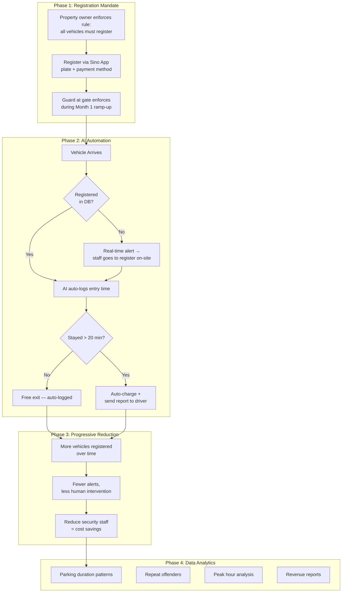

# Team Update: Kenneth's Strategy + Where We Are Now

**Date:** 2026-03-19
**From:** Andy
**To:** Sharon, Florence

## Kenneth Leung's Key Message (Meeting 2026-03-17)

> **"This is a business workflow problem, not a coding problem."**

Kenneth (SUST Director) met with us and reframed the entire project. Judges are Sino management — they care about **feasibility (30%) + cost-effectiveness (30%) = 60%**. A realistic, progressive solution beats a flashy AI demo.

### Kenneth's Proposed Workflow

### Kenneth's Key Pitch Points

- **"You can't solve 100%, but you solve it progressively"** — show human effort decreasing over iterations
- Real-time response speed is key: detect → alert → act, how fast?
- Auto-billing + transaction reports = clear accounting for management
- Data analytics = bonus feature judges will love
- Sino already has a property app — we propose adding a module to it (registration + payment)

### What Kenneth Wants Next from Us

1. Work out the **full workflow** with Sharon/Florence + Sino team (they know operational constraints)
2. For each step, identify: **automated** / **equipment-dependent** / **human-required**
3. Open invitation to pitch to him again once we have progress

---

## Where We Are Now (Prototype Status)

| Step | What Happens | Status |
|---|---|---|
| 1. Video Input | CCTV exports MP4 files from cameras GF15-18 | Working |
| 2. Frame Extraction | Processor grabs every 5th frame from video | Working |
| 3. Plate Detection | AI detects license plates (YOLO + OCR) | Working (30% accuracy) |
| 4. Validation | Only valid HK plates pass (2 letters + 1-4 digits) | Working |
| 5. Deduplication | Groups repeated reads, picks best one | Working |
| 6. Database | Saves plate, time, camera, crop image | Working |
| 7. Dashboard | Web page shows all detections with plate crops | Working |

### What We CAN Do Now

- Detect plates from CCTV video footage
- Show which vehicles appeared and when
- Group detections into "visits" (entry → exit sessions)
- Display crop images of each plate

### Gaps vs Kenneth's Vision

| Gap | Kenneth's Workflow Needs | Priority |
|---|---|---|
| Low accuracy (30%) | Must reliably read plates for auto-tracking | P0 — fixing now |
| No registration DB | Need plate → owner → payment lookup | P1 |
| Offline only | Need real-time processing for instant alerts | P1 |
| No alerts | Need WhatsApp notification for unregistered vehicles | P2 |
| No auto-billing | Need charge calculation + payment integration | P2 |
| No analytics | Need duration/pattern/revenue reports | P2 |

---

## Next Steps

### Tech (Andy)
1. **P0:** Integrate Plate Recognizer API → target 80%+ accuracy
2. **P1:** Build registration database
3. **P1:** Add duration tracking + overstay detection

### Business (Sharon & Florence)
- **Sharon:** Work out the registration workflow — how does a truck driver sign up? What info do we collect? Payment method options? Talk to Sino about their existing app
- **Florence:** Data analysis angle — what metrics would Sino management want to see? (peak hours, avg duration, repeat vehicles, revenue projection)
- **Both:** Review this workflow and flag any operational issues we missed. Kenneth specifically asked us to work this out together
