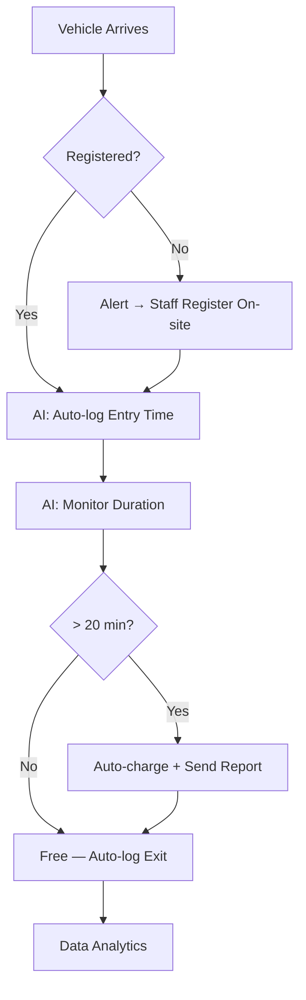

# Team Update: Kenneth Meeting + Budget Plan

**Date:** 2026-03-19
**From:** Andy
**To:** Sharon, Florence

## Kenneth Leung Meeting Summary (2026-03-17)

Met with Prof. Kenneth Leung (SUST Director). Key takeaway:

**This is a business workflow problem, not just an AI demo.** Judges (Sino management) care about feasibility and cost-effectiveness (60% combined). A realistic, progressive solution beats a flashy but impractical demo.

### Proposed Workflow

### Key Points

1. **Registration mandate** — All vehicles must register (plate + payment method) via Sino's property app or on-site
2. **Month 1: Guard enforces registration** — "You want to do business here? Register first"
3. **AI kicks in** — Registered plate → auto-track → auto-charge. Unregistered → alert staff
4. **Progressive automation** — Show how each iteration reduces human effort. This is the cost savings pitch
5. **Data analytics** — Bonus feature: parking duration, repeat offenders, peak patterns

### Kenneth's Next Steps for Us

- Work out full workflow with Sharon/Florence + Sino team (operational constraints)
- Identify: automated steps / equipment-dependent steps / human-required steps
- Open invitation to pitch to him again once progress is made

## Budget Summary

### Already Spent: HK$2,080

| Item | Cost (HKD) |
|---|---|
| Claude Max 20x (Month 1) | $1,950 |
| OpenRouter API | $84 |
| Tencent Cloud | $46 |

### Planned Spending: HK$3,450

| Item | Cost (HKD) | Priority | Usage |
|---|---|---| --- |
| Claude Max 20x (Month 2) | $1,950 | P0 | Coding |
| Plate Recognizer API | $500 | P0 | Plate recognition (demo day) |
| Better Cloud server (monthly) | $500 | P1 | realtime cctv footage |
| Wispr Flow | $180 | P2 | voice-to-chat tool to reduce my typing |

**Not buying:** 2x IP cameras ($10K — existing cameras sufficient), TimescaleDB ($1.5K — SQLite enough), AWS ($1K — Tencent + local processing enough).

Low spend directly supports cost-effectiveness score (30% of judging).
